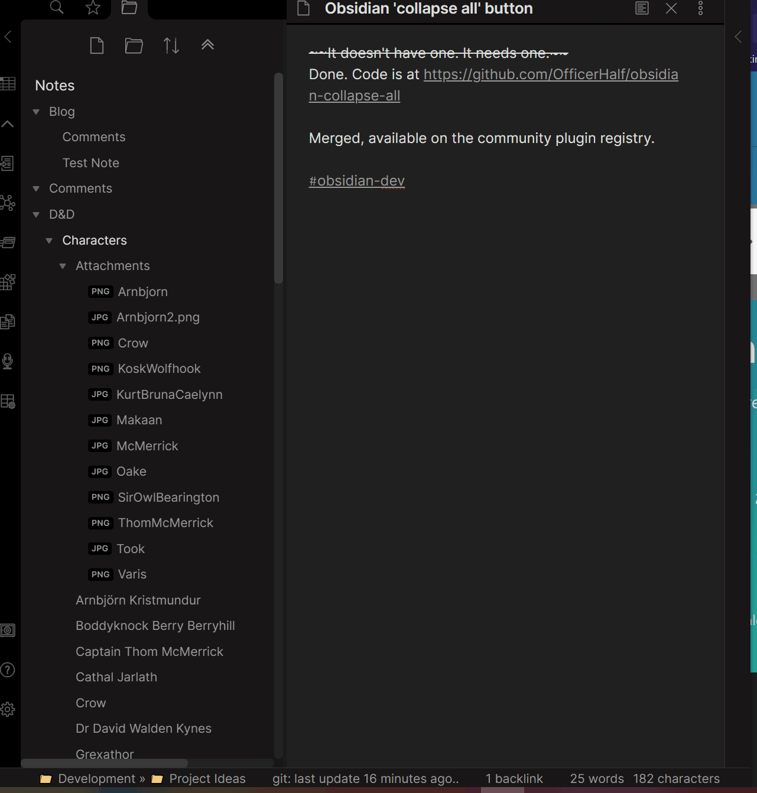

## Collapse All Obsidian Plugin

When your Obsidian file explorer is overloaded with open folders, close them all with a single click or command. Or, if you want to explore your folder tree, expand all folders.

## Usage

### Collapse

To collapse all folders, either click the new button at the top of the file explorer pane or run the "Collapse all open folders" command. When all folders are closed, the button becomes an expand all button.

### Expand

To expand all folders, either click the new button at the top of the file explorer pane or run the "Expand all open folders" command. When at least one folder or subfolder is open, the button becomes a collapse all button.

